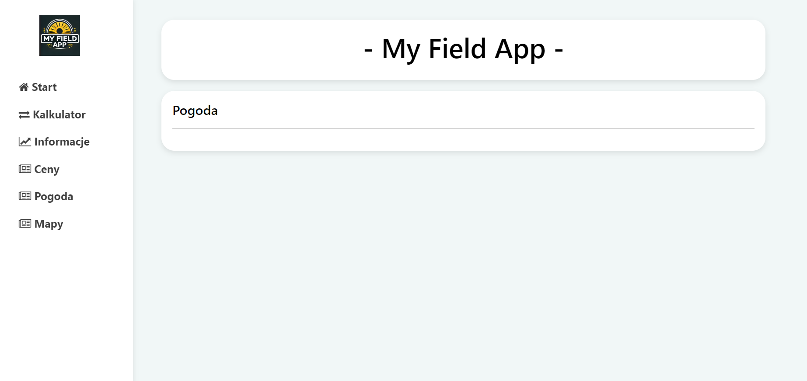

# My Field App

## Technologies
- Python
- Django
- Java Script
- JSON
- HTML
- CSS

## Installation

To use the project you need to clone it from Github.
You need to have Python and Django installed on your computer.

Install all required dependencies using the requirements.txt file:
```bash
pip install -r requirements.txt
```

To start the project, use the command:
```bash
  python manage.py runserver
```

The server will run on the default port 8000, so you can access the application in your browser at the address:
http://127.0.0.1:8000


## Screenshots

